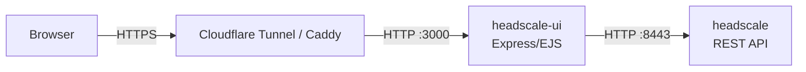

# Headscale UI

A lightweight web interface for managing a [Headscale](https://github.com/juanfont/headscale) instance via its REST API. Runs as a separate Docker container alongside your existing Headscale setup.

## Features

- **Devices** — list, rename, delete nodes; register new devices by node key
- **Users** — list, create, delete Headscale users
- **Pre-Auth Keys** — create (reusable, ephemeral, custom expiry), list, and expire keys per user
- Bootstrap 5 UI with responsive tables and card layouts
- Session-based admin login with bcrypt and rate limiting
- All Headscale API calls are server-side — the API key never reaches the browser

## Setup

### 1. Generate a Headscale API key

On your Headscale server:

```bash
docker exec headscale headscale apikeys create --expiration 365d
```

Copy the returned key.

### 2. Clone the repository

Clone into a subdirectory alongside your existing Headscale compose setup:

```bash
git clone https://github.com/fredsimard/headscale-ui.git
```

### 3. Create the `.env` file

```bash
cp headscale-ui/.env.example .env
```

> **Note:** Place the `.env` file in the same directory as your main `docker-compose.yml`, not inside the `headscale-ui` subfolder.

Edit `.env` and fill in:

| Variable | Description |
|---|---|
| `HEADSCALE_URL` | Internal Docker URL of Headscale — check your `config.yaml` for `listen_addr` (e.g., `http://headscale:8443`) |
| `HEADSCALE_API_KEY` | The API key from step 1 |
| `ADMIN_USERNAME` | Login username (default: `admin`) |
| `ADMIN_PASSWORD_HASH` | bcrypt hash of your password (see below) |
| `SESSION_SECRET` | A long random string for session signing |

> **Important:** The default port is `8080` but your Headscale may be configured to listen on a different port (e.g., `8443`). Check the `listen_addr` value in your Headscale `config.yaml` to confirm.

### 4. Generate the password hash

Run this on any machine with Node.js installed:

```bash
npm install
node hash-password.js 'your-secure-password'
```

Paste the output into `ADMIN_PASSWORD_HASH` in your `.env` file.

### 5. Merge the docker-compose.yml

Add the `headscale-ui` service from `headscale-ui/docker-compose.yml` into your existing `docker-compose.yml`. Make sure to use `ports` (not `expose`) so the UI is accessible from the host, and include the named volume so preferences persist across rebuilds:

```yaml
services:
  headscale-ui:
    build:
      context: ./headscale-ui
      dockerfile: Dockerfile
    container_name: headscale-ui
    restart: unless-stopped
    env_file: .env
    environment:
      - NODE_ENV=production
      - TRUST_PROXY=true
    volumes:
      - headscale_ui_data:/app/data
    depends_on:
      - headscale
    ports:
      - "3000:3000"

volumes:
  headscale_ui_data:
```

> **Note:** The `headscale_ui_data` volume stores user preferences (timezone, date format, theme, etc.) on disk. Without it, preferences reset every time the container is rebuilt.

### 6. Configure reverse proxy (optional)

**Caddy:** Add the snippet from `Caddyfile.example` to your Caddyfile, replacing the domain with yours.

**Cloudflare Tunnel:** Point a public hostname to `http://localhost:3000`. No Caddy configuration needed for the UI in this case.

### 7. Deploy

From the directory containing your main `docker-compose.yml`:

```bash
docker compose up -d --build
```

The UI will be available on port 3000, or through your reverse proxy/tunnel on your configured domain.

## Development

```bash
npm install
cp .env.example .env
# Edit .env with your local Headscale details and a password hash
npm run dev
```

The dev server uses `--watch` for auto-reload on file changes.

## Architecture



- The UI runs as a separate Docker container — Headscale is unaware of its existence
- All Headscale API calls are made server-side using the API key
- Authentication is handled entirely by the UI app, independent of Headscale
- Session data (login) is in-memory — restarts require re-login, but preferences persist on disk via the `headscale_ui_data` volume
- Both containers must be on the same Docker network for internal communication